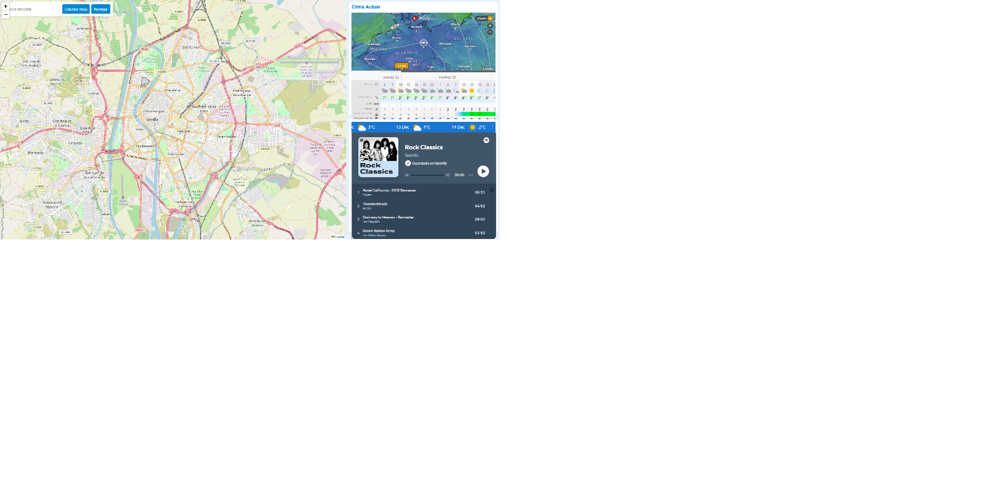

# OpenDrive



**OpenDrive** es un proyecto que transforma cualquier tablet antigua o en desuso en un avanzado navegador multimedia para automóviles. Este sistema está diseñado para brindar una solución accesible y funcional, aprovechando dispositivos existentes y software de código abierto.  

## Características principales

- **Interfaz minimalista**: Navegación sencilla y adaptada para su uso mientras conduces.  
- **Navegador web**: Accede fácilmente a contenido en línea, como mapas o plataformas de streaming.  
- **Widget de clima**: Visualiza las condiciones meteorológicas actuales y las previsiones directamente desde la interfaz.  
- **Diseño responsivo**: Se adapta automáticamente al tamaño de la pantalla de tu tablet.  
- **Código abierto y personalizable**: Ideal para los entusiastas del software libre y los makers.  

## Requisitos del sistema

1. Una tablet o dispositivo Android/iOS (preferentemente sin uso).  
2. Soporte para montar la tablet en el salpicadero del coche.  
3. Conexión a internet para las funciones de navegador y clima (opcional, según las necesidades).  

## Instalación

1. Clona este repositorio en tu dispositivo o descárgalo como un archivo ZIP.  
   ```bash
   git clone https://github.com/<tu-usuario>/OpenDrive.git
